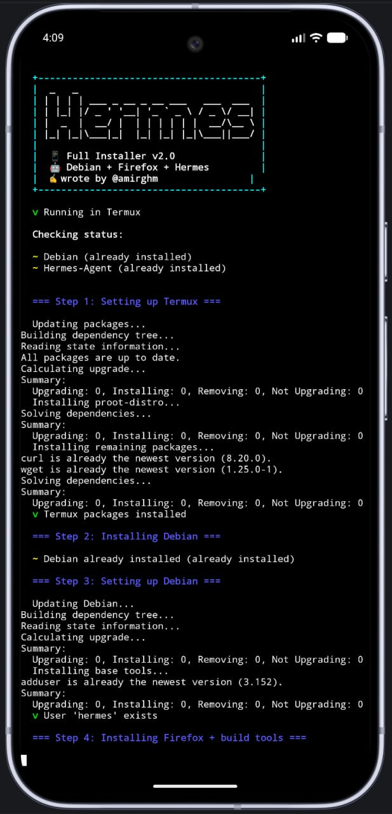
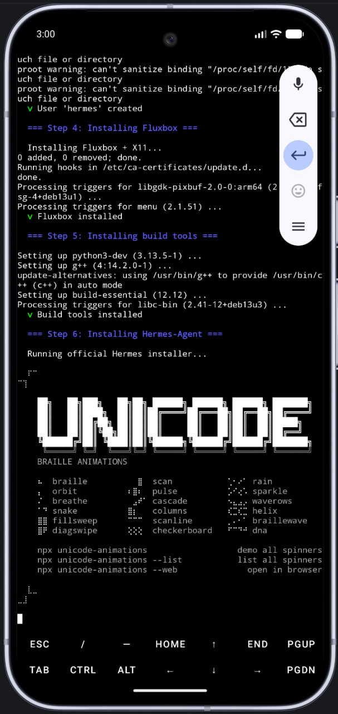
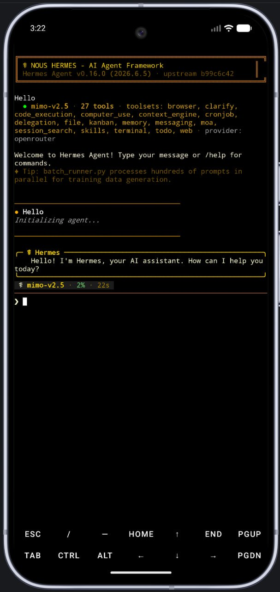

<p align="center">
  
</p>

# Hermes-Agent Mobile ☤

<p align="center">
  <a href="https://github.com/amirghm/hermes-agent-mobile/releases"></a>
  <a href="https://hermes-agent.nousresearch.com"></a>
  <a href="https://github.com/amirghm/hermes-agent-mobile/blob/main/LICENSE"></a>
</p>

<p align="center">
  
  
  
</p>

🤖 **Your AI assistant, right in your pocket.**

Hermes-Agent is a fully featured AI agent framework. This project brings it to Android (Termux) and iOS (iSH), so you get a personal AI that's always with you. No cloud servers, no laptop needed. Just your phone and an API key.

## Why Run Hermes on Your Phone?

**🏠 Always Available**
Your assistant lives in your pocket. No booting a laptop, no SSH into servers. It's just there, ready to go.

**👥 Team of Agents**
Run multiple AI personas at the same time, each with their own personality and role. Like having a full team in your pocket.

**💬 Talk Through Telegram**
Send voice messages, images, files to your agents through Telegram. They respond like real team members. You can even create a group with all of them.

**💰 Super Low Cost**
Runs on cheap API models like Mimo v2.5 via OpenRouter. No expensive GPU server needed.

**🔋 Runs in Background, Saves Battery**
Hermes keeps running even when your screen is off. With a few settings, your agents work 24/7 without draining your battery. [Guide: Keep Hermes alive in the background](docs/phantom-killer-guide.md)

**✈️ Take It Anywhere**
Install on any phone in under 5 minutes. Your entire AI setup is portable.

**🔒 Your Data Stays Private**
No third-party servers storing your conversations. API calls go straight from your phone to the model provider.

## Use Cases

**Personal assistant on the go**
Ask questions, get translations, summarize articles, manage your schedule. All from your phone, even with the screen off.

**Team of AI agents**
Create a Telegram group with 7 agents, each with a role. Kaveh manages the team, Shirin handles marketing, Dariush writes code, Yasaman analyzes data. Mention any of them and they respond.

**Voice-powered workflow**
Send a voice message in Persian, English, or German. Hermes transcribes it, understands it, and responds. You can even have it read back the response.

**Automated monitoring**
Set up cron jobs to monitor websites, check prices, send alerts. Your phone becomes a 24/7 monitoring station.

**Content creation**
Generate blog posts, social media content, scripts. Have agents collaborate on bigger pieces of work.

## What Works on Termux

| Feature | Status | Notes |
|---------|--------|-------|
| Chat / CLI mode | ✅ | Core functionality |
| Telegram Gateway | ✅ | Full bot integration with groups |
| Voice input (STT) | ✅ | Speechmatics with auto language detection |
| Voice output (TTS) | ✅ | Edge TTS with Persian voice |
| Memory | ✅ | Persistent across sessions |
| Skills | ✅ | Load, create, manage skills |
| Cron jobs | ✅ | Scheduled tasks and monitoring |
| File operations | ✅ | Read, write, edit files |
| Web search | ✅ | Brave search API |
| Browser | ✅ | Firefox headless via Playwright |
| Chromium | ❌ | PRoot sandbox issues. Always use Firefox |
| Image generation | ✅ | Via API (FAL, OpenAI, etc.) |
| Multiple agents | ✅ | Run 7+ bots at the same time |
| Subagent delegation | ✅ | Parallel task execution |
| Background running | ✅ | With Phantom Killer disabled |

## What Works on iSH (iOS)

| Feature | Status | Notes |
|---------|--------|-------|
| Chat / CLI mode | ✅ | Via hermes-agent --prompt |
| Telegram Gateway | ❌ | iSH lacks subprocess syscalls |
| Voice input (STT) | ❌ | Requires gateway mode |
| Voice output (TTS) | ❌ | Requires gateway mode |
| Memory | ✅ | Persistent across sessions |
| Skills | ✅ | Available in CLI mode |
| Cron jobs | ❌ | Requires gateway mode |
| File operations | ✅ | Read, write, edit files |
| Web search | ✅ | Via API calls |

## Quick Install

### 📱 Android (Termux)

One command does everything: installs Debian, Firefox, and Hermes.

```sh
bash <(curl -fsSL https://raw.githubusercontent.com/amirghm/hermes-agent-mobile/main/scripts/install-termux.sh)
```

After install, Hermes will guide you through setup (API key, model selection, etc.)

**Recommended model:** `xiaomi/mimo-v2.5` (free via OpenRouter)

- `hermes` - Start Hermes chat
- `hermes setup` - Configure API key & model
- `debian` - Enter Debian shell

### 🍎 iOS (iSH)

```sh
sh <(curl -fsSL https://raw.githubusercontent.com/amirghm/hermes-agent-mobile/main/scripts/install-ish.sh)
```

For iSH, configure manually after install:

```sh
nano ~/.hermes/.env
```

Add your OpenRouter API key (get one free at https://openrouter.ai):

```
OPENROUTER_API_KEY=sk-or-...
```

## Requirements

| Platform | What you need |
|----------|--------------|
| Android | Termux app (F-Droid version), ~500MB storage |
| iOS | iSH app (App Store), ~200MB storage |

## License

MIT
